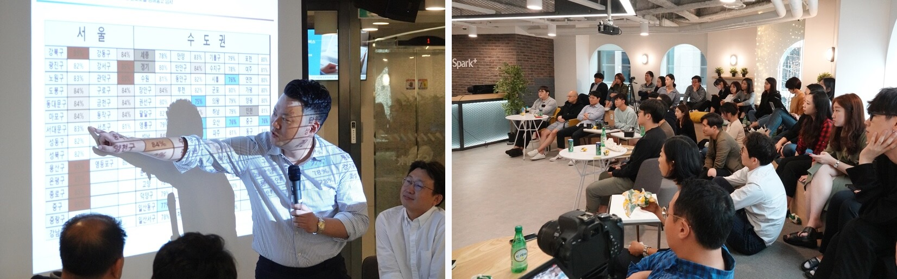

# *우리의 금융생활은 빠르게 변하고 있습니다.*
# *당신을 통해 어떻게 더 변화하게 될까요?*

***

## 피플펀드는 ‘*보통사람을 위한 보통이 아닌 금융*’ 을 만듭니다.
* 피플펀드는 ‘보통 사람’을 위해 기존 금융이 많이 변해야 한다고 믿습니다. 
* 혁신적인 기술(Tech) 과 금융(Fin)의 융합을 통해, 기존 금융의 비효율을 없애고 그 혜택을 고객에게 드리는 ‘보통이 아닌 금융’ 을 만들어 갑니다.

## 피플펀드의 성과
* 피플펀드는 약 200번째로 서비스를 런칭하여, 누적 취급액을 기준으로 현재 **업계 3위**를 유지하고 있습니다.
* 카카오톡 내에서 **카카오페이 투자서비스를 제공**하며 전국민 서비스로 성장하고 있습니다.
* 카카오페이, 500 Startups, 데일리금융그룹 등으로부터 **누적 187억원을 투자 유치**하였습니다.
* **한국핀테크산업협회 회장사**로서 P2P산업은 물론 핀테크산업의 성장을 위해 앞장서고 있습니다.

## 기본정보
* 회사위치 : 선릉역
* 업무시간 : 일 8시간 (출퇴근 시간은 오전 8시~10시 사이에서 선택 가능)
* 급여 : 현재급여 이상부터 협의
* 기기지원 : 최신형 MacBook Pro + 27인치 Dell 모니터

## 이런 성향을 지닌 분이 저희와 잘 맞습니다.
* 문제의 핵심을 파악하고자 노력하며 근본적인 해결을 추구하는 분
* 조직의 부족함과 실패를 알리는 것을 두려워하지 않는 분
* 자율성을 스스로 책임지실 수 있는 분
* 고객경험의 가치를 중요하게 생각하시는 분

## 이런 성향을 지닌 분은 저희와 잘 맞지 않을 수 있습니다.
* 역할과 책임이 명확히 구분되어야 일을 잘할 수 있는 분
* 책임보다 권리를 더 중요한 가치로 두고 계신 분
* 고객경험의 가치보다 코드품질의 가치를 더 중요하게 생각하시는 분
* 좋은 업무 문화는 개인이 아닌 조직장이 만들어주는 것이라고 생각하시는 분

## 지원방법
* hr@peoplefund.co.kr 로 자유형식 이력서(PDF) 제출
* 선택사항: 포트폴리오(PDF), GitHub ID 등 제출

## 업무조직 (제품본부, Product Division)
* Engineer 가 일할 **‘제품본부’는 기술을 통해 금융을 혁신**하는 조직입니다.
* 본부를 이루는 **각 팀은 목표와 문제의식을 공유하는 애자일 조직**입니다.
* 팀은 Engineer, Product Designer, Product Manager 로 구성됩니다.
* 팀은 **문제해결의 자율성을 보장받지만 성과에 대한 책임**을 갖습니다.

## 업무방식
* Waterfall 방식은 거부합니다. **Agile 방식을 고집**합니다.
* **팀이 직접 문제를 발굴하고 근본적인 해결책을 고민하며 진화**해야 합니다.
* **열린 토론을 지향**합니다. 대화해야만 변화할 수 있습니다.
* **회고**합니다. 모든 성공과 실패를 돌아보며 성장합니다.
* 모두가 데이터를 이해하고 검증하며, **데이터로 논의**합니다.
* WIP(진행중 작업) 수를 제한하고, 작은 일들은 **Quick Fix Day**에 모아서 처리합니다.

## 업무환경
**업무별, 개인별 특성에 따른 최적의 업무공간을 제공합니다.**
* Wework 의 한 층을 독립적으로 사용하여 쾌적한 업무환경을 제공합니다.
* 개별 업무공간, 집중 업무공간, 개방형 업무공간, 용도별 회의실, 캔틴, 휴게공간, etc

**’최고의 복지는 훌륭한 동료’ 임을 모두가 경험하고 있습니다.**
* 권한 뿐 아니라 책임까지 이해하는 사람, 입장 차이에도 ‘One team’ 을 잊지 않는 사람들과 함께 합니다.
* 피플펀드의 가장 큰 자산은 이러한 사람들이 함께 한다는 것이며, 이를 모두가 자랑스러워 합니다.
* 이를 지켜나가고자 직군과 무관하게 모든 신규입사자의 최종면접은 대표이사의 인성면접으로 이루어지며 피플펀드가 가진 가치를 공유하고 점검합니다.

## Engineer 의 업무
* 문제가 정확히 정의되었는지 파악하고 근본적인 문제를 해결할 수 있는 탁월한 기술적 해결방안을 제시합니다.
* 금융기관의 시스템을 대체하는, 세상에 없던 금융시스템을 만들고 개선합니다.
* 대출고객에게 최고의 대출경험을 제공하고 개선합니다.
* 투자고객에게 최고의 투자경험을 제공하고 개선합니다.
* 전국민 서비스임을 이해하고 Scalable 한 구조를 설계, 구현합니다.
* 자금 및 고객경험에 대한 방대한 정보들을 분석하고 전략을 도출합니다.

## Engineer 의 성장 지원
* 피플펀드의 구성원은 모두 새로운 배움과 성장을 중요하게 생각합니다.
* Engineer 들의 **기술 세미나**는 주단위로 진행됩니다.
* 내외부 Engineer 들과 함께 **[스타트업 테크 챌린지](https://tech.peoplefund.co.kr/2019/04/11/startup-tech-challenge-3rd-epilogue.html)** 를 반기마다 진행합니다.
* 신규입사자의 적응기간에는 **소프트랜딩 제도**를 시행합니다.
* 일상업무가 즉 성장이 되도록, **Pair Programming 과 Peer Review**를 강조합니다.
* 반기마다 정성적 인사평가 **‘[Growth Review](https://peoplefund.blog/growth-review/)’** 를 진행하여 서로의 성장을 돌아보고 공유합니다.

## Engineer 공통 자격요건
* 컴퓨터 공학에 대한 이해도가 있는 분
* 최고의 제품을 위한 프로세스와 개발문화를 만들 욕구와 의지가 있는 분
* 효율적인 아키텍처에 대해 끊임없이 고민하는 분
* IT관련 영문 자료를 습득 및 체화가 가능하신 분
* 기술적으로 어떠한 분야에서든지 한 가지 이상 심도있는 경험을 해보신 분
* 산업기능요원 전직 / 보충역 지원 가능

## Full Stack Software Engineer 자격요건
* 사업적/기술적 문제를 해결하기 위해 stack의 경계없이 해결책을 제시하고 실현한 경험이 있는 분
* 웹 프론트엔드와 모바일 앱 중 하나의 stack을 활용해 프로젝트를 유지보수해본 경험이 있는 분
* 백엔드 stack을 활용해 프로젝트를 유지보수 해본 경험이 있는 분
* SQL이 RDBMS 성능에 미치는 영향을 이해하고 있으며, RDBMS를 간단히 튜닝해본 경험이 있는 분
* 하루에 1만명 이상의 유저가 사용하는 웹서비스의 인프라스트럭처를 설계하고 구현해본 경험이 있는 분
* 명료하고 간결한 코드를 추구하는 분

## Front-end Engineer 자격요건
* 더 좋은 UX를 위해 끊임없이 고민하는 분
* HTML, CSS, JavaScript를 충분히 이해하고 있는 분
* 모바일 웹 / 반응형 웹 / SPA 개발 경험이 있는 분
* 명료하고 간결한 코드를 추구하는 분

## Back-end Engineer 자격요건
* 한 가지 이상의 서버 사이드 언어에 능숙한 분 (Python 우대)
* RDBMS에 대한 이해와 SQL을 자유롭게 다룰 수 있는 분
* 테스트 방법론에 대한 이해도가 있는 분
* 명료하고 간결한 코드를 추구하는 분

## iOS Application Engineer 자격요건
* iOS 앱 개발 경력 최소 3년 이상
* Swift 언어에 능숙하신 분
* Auto Layout에 대한 이해
* 네트워크/앱 보안에 대한 이해
* 상용 애플리케이션 운영 경험
* 명료하고 간결한 코드를 추구하는 분

## Site Reliability Engineer(DevOps Engineer) 자격요건
* 리눅스와 네트워크를 잘 알고 있으며 기본적인 보안에 대한 지식이 있는 분
* AWS 제품을 다양하게 경험해보신 분
* 한가지 이상 프로그래밍 언어에 능숙하신 분
* RDB, NoSQL DB 운영 경험이 있는 분
* Nginx 등 웹서버 구축 및 운영 경험이 있는 분
* 사내 네트워크 구축 및 운영이 가능하신 분
* 인프라 운영 등의 자동화 경험이 있는 분

## 병역특례 - 산업기능요원
* 피플펀드는 2018년 병역지정업체로 선정되었으며 2018년 말부터 지속적으로 모든 직군에서 산업기능요원을 채용하고 있습니다.
* 산업기능요원에 대한 별도 절차가 마련되어 있지 않습니다. 상기된 직군별 자격요건과 면접 절차 모두 동일하게 진행합니다.

### 보충역
* 보충역은 상시 채용합니다.

### 현역
* 현역인 경우 사전에 배정인원을 확보하고 채용할 수 없습니다. 병역지정업체에서 미리 근무하며 현역 배정을 기다리는 사람에게 우선 배정하기 때문입니다.
* 피플펀드는 2019년 11월 2명의 현역 배정인원을 받게 되었고, 회사에서 근무하며 기다리시던 두 분이 모두 현역으로 편입되었습니다.
* 피플펀드에 입사하시면 입사일을 기준(같은 날에 입사하는 경우 입사지원 시각 기준)으로 대기 순번이 할당되며, 병무청으로부터 산업기능요원 배정인원을 받는 경우 대기 순번에 따라 현역으로 편입됩니다.
* 2019년 12월 19일을 기준으로 다음 배정을 기다리는 분은 없습니다.

## 병역특례 - 전문연구요원
* 피플펀드는 2019년 11월 기업부설연구소를 인정받고 전문연구요원을 채용할 수 있게 되었습니다.
* 2020년부터 근무하실 수 있을 것으로 기대하고 있으며, 관련 문의는 이메일(hr@peoplefund.co.kr)로 해주시기 바랍니다.

## 피플펀드의 기술 Stack
다음의 기술을 주로 활용하며, 문제해결을 위한 적정기술의 도입에 주저하지 않습니다.
* Front-End: Next.js, React.js, Less
* App: Kotlin, Swift
* Back-End: Python (Django, serverless)
* DBMS: MySQL, Amazon Redshift
* Infra: AWS, Docker, Kong
* Co-Work: git-flow, Slack, Jira, Confluence
* 자세한 내용은 [StackShare](https://stackshare.io/peoplefund/peoplefund)를 참고해주세요.

## 피플펀드 문화 엿보기
* 피플펀드 서비스 특성 상, 정말 **다양한 직군** (개발자, 변호사, 회계사, 마케터, 디자이너, 부동산 심사역, 경영전략 등) 의 사람들이 모여 있어 많은 관점을 동시에 볼 수 있습니다. 모두의 유일한 공통점은 ‘**똑똑하고 좋은 사람들**’ 이라는 점입니다.
* 정해진 연차 내에서 **휴가는 자유롭게** 사용합니다. 부재기간의 인수인계는 철저히 합니다.
* 회식에서 먼저 가는 사람은 붙잡지 않습니다. 사실 가끔 붙잡긴 하지만 강요하지 않습니다.
* 주 1회 ‘**랜덤 런치 버디**’ 로 이야기 나눌 기회가 없었던 분들과 맛있는 것도 먹으며 서로를 알아가고 일상을 나눕니다.
* **가족을 중요시합니다**. 문화와 제도적 뒷받침 (출산 시 1개월 재택근무 등) 덕분인지, 피플펀드에 입사하신 후 결혼하시거나 아이를 낳으시는 분들이 매우 많습니다. **아이들이 참 귀엽습니다.**
* 업무뿐만 아니라 자기계발에 도움이 되는 도서들은 모두 자유롭게 구매요청 하실 수 있습니다.
* 점심비용은 회사가 제공합니다. 커피, 간식, 맥주는 무한 제공합니다.
* 모두의 건강을 위해 건강검진 역시 회사가 제공합니다.

#### <피플 클래스, 부동산 토론회 : 내 집, 지금 사야 하는가?>

#### <풋살동호회>

#### <사사모: 4계절 3삼오오 모여서 사진찍는 모임>

## 지원절차
* 이력서 제출: hr@peoplefund.co.kr 로 자유형식 이력서(PDF) 제출(선택사항: 포트폴리오(PDF), Github ID 등)
* 온라인 심사: 서류심사 (상황에 따라 전화/화상으로 짧은 사전 면접 가능)
* 오프라인 기술 면접: 기술 인터뷰 및 코딩 테스트 (필요시 과제 수행)
* 오프라인 최종 면접: 대표이사 인터뷰

## 피플펀드의 제품
* 피플펀드는 웹 서비스와 안드로이드 앱 두 개의 제품을 출시했습니다.
* 웹서비스: https://www.peoplefund.co.kr
* 안드로이드 간편투자 앱: https://play.google.com/store/apps/details?id=kr.co.peoplefund.investment&hl=ko
